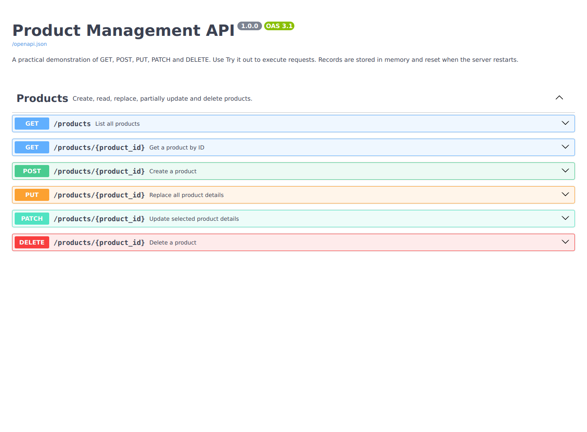
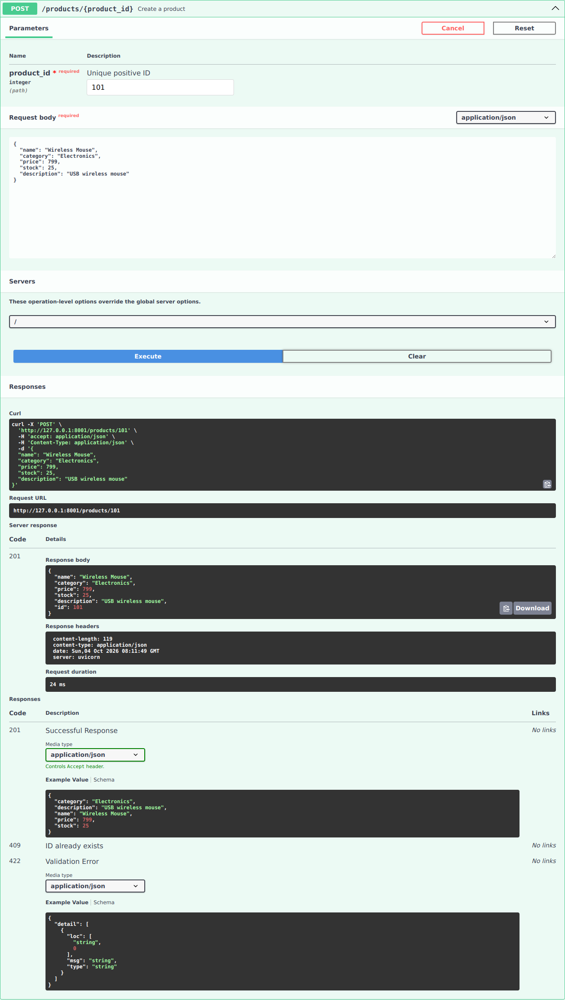
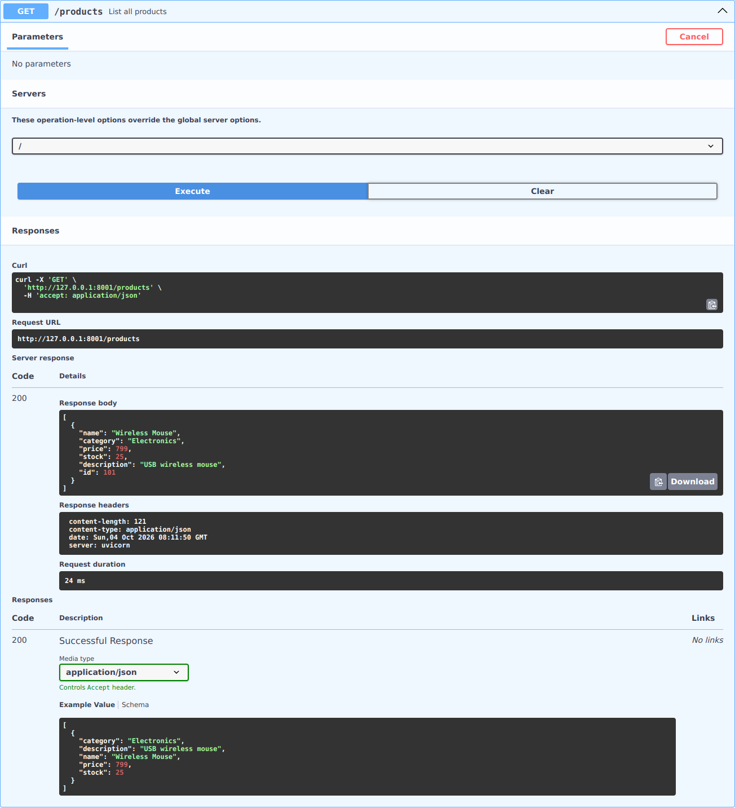
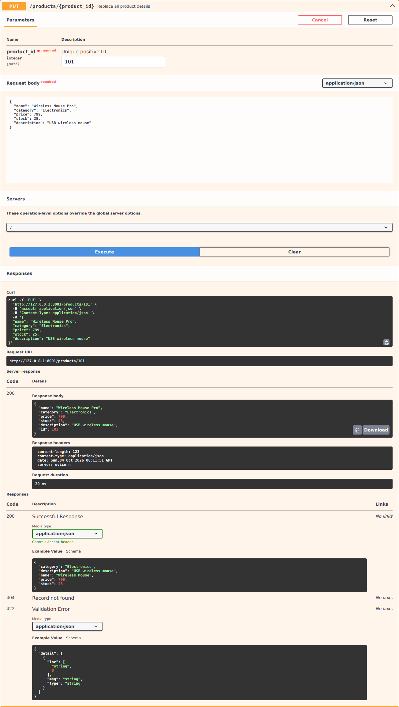
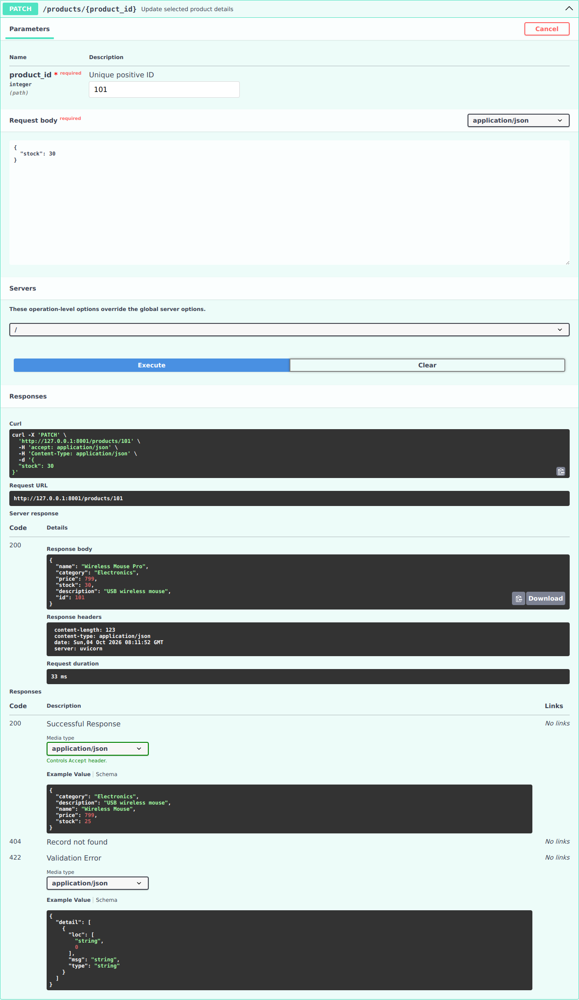
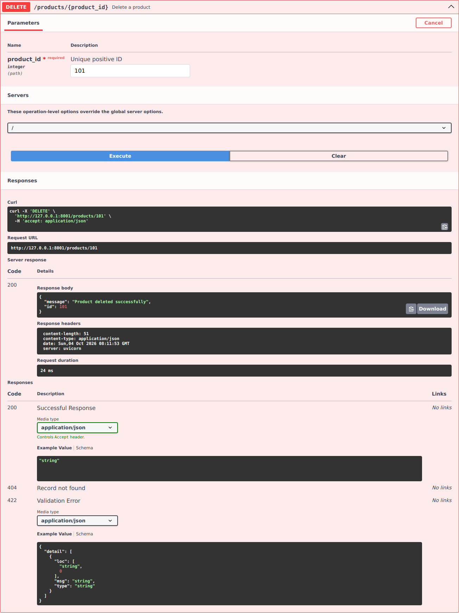

# Product Management API — FastAPI Practical

**Name:** K. Pranav  
**Roll number:** 2520030477

A runnable Python practical demonstrating **GET, POST, PUT, PATCH and DELETE** through FastAPI's interactive Swagger UI. This implementation was newly created for this submission; the screenshots below were captured by running this implementation with sample data.

## What the practical demonstrates

- Create, list, retrieve, fully replace, partially update and delete products.
- Validate request bodies with Pydantic and validate positive IDs.
- Return `201` for creation, `200` for successful reads/updates/deletion, `404` for missing records, `409` for duplicate IDs and `422` for invalid input.
- Explore and execute HTTP calls at `/docs`; inspect the generated schema at `/openapi.json`.

**Storage:** Records are held in a Python dictionary in memory. They reset on server restart or reload. No MySQL, MongoDB or SQL setup is required. Run a single worker for this practical.

## Files

| File | Purpose |
|---|---|
| [`main.py`](main.py) | FastAPI application, Pydantic models and HTTP endpoints |
| [`requirements.txt`](requirements.txt) | Runtime packages with tested versions |
| [`requirements-dev.txt`](requirements-dev.txt) | Additional packages for automated tests |
| [`test_api.py`](test_api.py) | HTTP behavior and validation tests |
| [`screenshots/`](screenshots/) | Actual Swagger screenshots from this implementation |

## Run in VS Code on Windows

Install Python 3.10 or later. Download or clone the repository, then open a terminal in **this folder**, where `main.py` is located.

```powershell
py -m venv .venv
.\.venv\Scripts\python.exe -m pip install -r requirements.txt
.\.venv\Scripts\python.exe -m uvicorn main:app --host 127.0.0.1 --port 8001 --reload
```

Open **http://127.0.0.1:8001/docs**. Keep the terminal running. Press `Ctrl+C` to stop.

These commands use the virtual environment's Python directly, so PowerShell activation-policy changes are unnecessary. If `py` is unavailable but Python is installed, use `python -m venv .venv` for the first command.

## Run on Linux or macOS

```bash
python3 -m venv .venv
.venv/bin/python -m pip install -r requirements.txt
.venv/bin/python -m uvicorn main:app --host 127.0.0.1 --port 8001 --reload
```

Student Management uses port **8000** and Product Management uses **8001**, so both can run simultaneously in separate terminals. If a port is occupied, choose another port and use that port in the browser URL.

Swagger UI loads its JavaScript and CSS from a CDN, so the browser needs internet access to display `/docs`.

## HTTP endpoints

| Method | Endpoint | Operation | Success |
|---|---|---|---|
| GET | `/products` | List all records, sorted by ID | 200 |
| GET | `/products/{product_id}` | Retrieve one record | 200 |
| POST | `/products/{product_id}` | Create a new record with the supplied ID | 201 |
| PUT | `/products/{product_id}` | Replace every detail of an existing record | 200 |
| PATCH | `/products/{product_id}` | Update only the fields supplied | 200 |
| DELETE | `/products/{product_id}` | Delete an existing record | 200 |

The ID is a **path parameter**. POST and PUT details are supplied as a **JSON request body**; PUT requires all fields. PATCH requires at least one field. Unknown fields, explicit null values and blank names are rejected. PUT and PATCH retain the original record ID.

## Record fields

| Field | Python type | Validation |
|---|---|---|
| `name` | `str` | min_length=1; max_length=100 |
| `category` | `str` | min_length=1; max_length=100 |
| `price` | `float` | ge=0; allow_inf_nan=False |
| `stock` | `int` | ge=0 |
| `description` | `str` | min_length=1; max_length=500 |

All fields above are required for POST and PUT. Responses also contain the `id`.

## Demonstration in Swagger

1. Expand **POST /products/{product_id}**, click **Try it out**, enter ID **101**, and paste:

```json
{
  "name": "Wireless Mouse",
  "category": "Electronics",
  "price": 799.0,
  "stock": 25,
  "description": "USB wireless mouse"
}
```

2. Click **Execute**. Expect **201** and a response containing ID 101.
3. Execute **GET /products** and **GET /products/101** to show the saved record.
4. Execute **PUT /products/101** using the complete body above with a changed name.
5. Execute **PATCH /products/101** with:

```json
{
  "stock": 30
}
```

6. Execute **DELETE /products/101**. Expect a success message.
7. Execute **GET /products/101** again. Expect **404**.

For validation, try POST with a negative numeric value. For conflict handling, repeat POST with an ID that already exists.

## Screenshots — actual Swagger UI

Screenshots were captured from this newly created API, with genuine HTTP responses and illustrative sample data. They show the overview and successful POST, GET, PUT, PATCH and DELETE requests. They do not claim to reproduce a previous local run.

### API overview


### POST — create a record (201)


### GET — list records (200)


### PUT — replace the full record (200)


### PATCH — update selected fields (200)


### DELETE — remove a record (200)


## Automated tests

From this folder on Windows:

```powershell
.\.venv\Scripts\python.exe -m pip install -r requirements-dev.txt
.\.venv\Scripts\python.exe -m pytest -q
```

On Linux/macOS, use `.venv/bin/python` instead. Tests cover the full record lifecycle, duplicate IDs, missing records, invalid values, empty or null PATCH bodies, complete PUT requirements, ID validation and the Swagger/OpenAPI endpoints. Tests use isolated in-memory data; they do not require a running server.

## Backend flow

Swagger sends an HTTP request → FastAPI selects the route → Pydantic validates the parameters/body → the handler accesses the in-memory dictionary → FastAPI returns JSON and a status code.

`main:app` means: load the file `main.py` and serve its FastAPI object named `app`. Uvicorn is the server that runs it. GitHub stores and displays these files; it does not run the Python API.

## References

- [FastAPI first steps and Swagger](https://fastapi.tiangolo.com/tutorial/first-steps/)
- [FastAPI request bodies](https://fastapi.tiangolo.com/tutorial/body/)
- [FastAPI partial updates](https://fastapi.tiangolo.com/tutorial/body-updates/)
