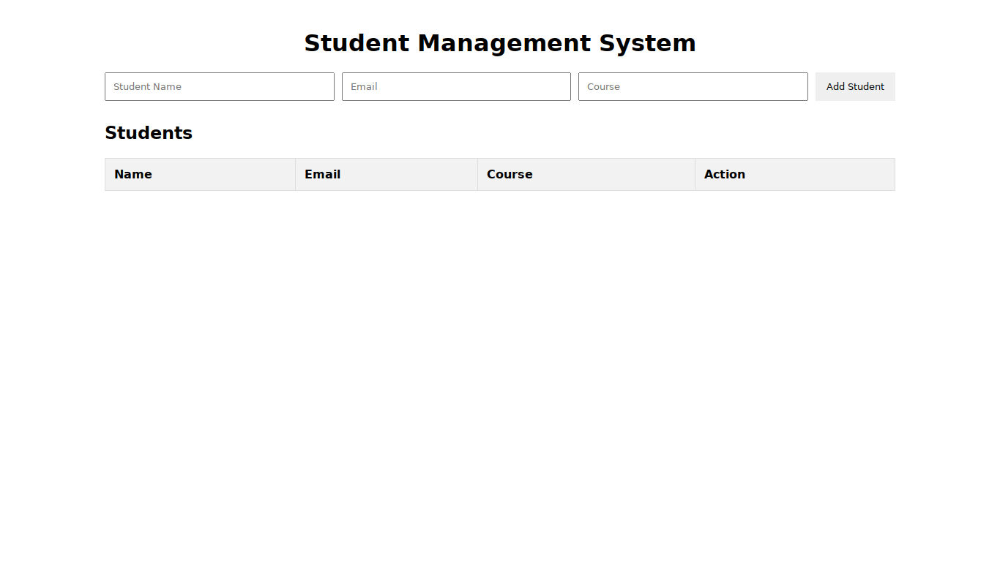
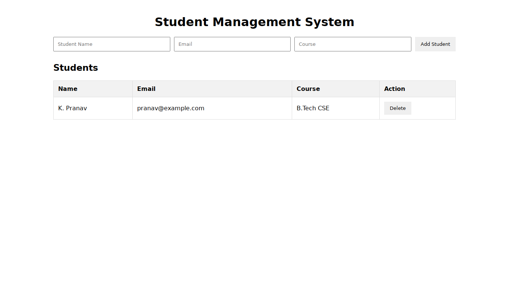
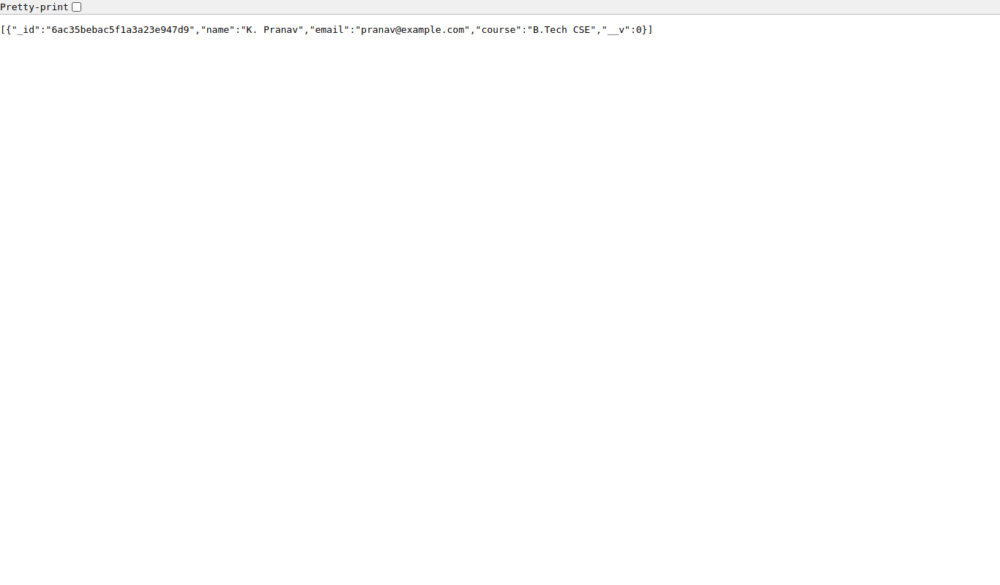
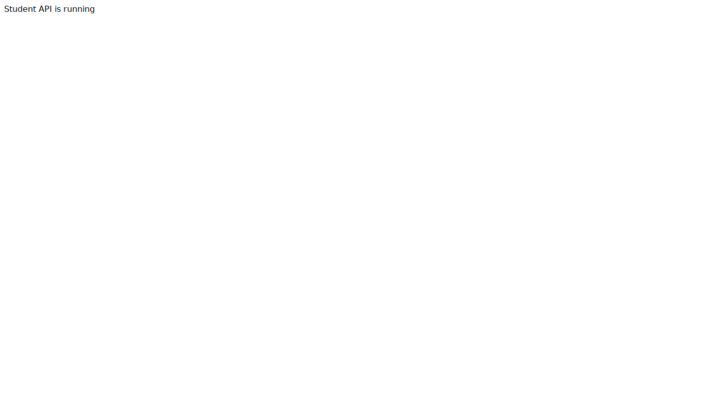

# Student Management with Express and MongoDB

A student management practical built from the supplied StudentManagement(MERN) guide. React and Axios call a Node.js / Express REST API; Mongoose stores students in MongoDB. Features: add a student, view students, and delete a student. Student fields are `name`, `email`, and `course`.

## Main modules

| File | Responsibility |
| --- | --- |
| `backend/server.js` | Express startup, CORS, JSON middleware, MongoDB connection and route registration |
| `backend/models/Student.js` | Mongoose student schema and model |
| `backend/routes/studentRoutes.js` | GET, POST and DELETE student routes |
| `backend/.env.example` | MongoDB configuration template |
| `frontend/src/App.jsx` | Form, student table and Axios requests |
| `frontend/src/main.jsx` | React application entry point |
| `frontend/src/App.css` | Form and table styles |
| `api/Student-Management.postman_collection.json` | Importable requests for API testing |

The guide's inline schema and routes have been separated into modules. Startup waits for MongoDB, and an error handler handles failed requests. The original add/view/delete scope is preserved; there is no update route or authentication. This is a learning practical, with basic browser-required fields rather than comprehensive server-side validation.

## Requirements

- Node.js 22.12+ or a newer supported LTS release, and npm.
- Local MongoDB running, or an Atlas database connection string.
- VS Code or another code editor.

## Run the backend

Open a terminal in this folder:

```powershell
cd backend
npm ci
Copy-Item .env.example .env
```

On macOS/Linux use `cp .env.example .env` instead. For local MongoDB, the template uses:

```dotenv
MONGO_URI=mongodb://127.0.0.1:27017/studentdb
```

For Atlas, replace the value in your private `.env` with your own connection string, including the database name. Configure your Atlas database user and network access. Do not commit credentials; `.env` is ignored.

Start the server:

```shell
npm run dev
```

Expected output: `MongoDB connected` and `Server running on http://localhost:5000`.

## Run the frontend

Open a second terminal in this project folder:

```shell
cd frontend
npm ci
npm run dev
```

Open **http://localhost:5173**. Keep both terminals running. The frontend calls **http://localhost:5000/api/students**.

For a production frontend build, run `npm run build` from `frontend`.

## API endpoints

| Method | URL | Purpose | Success status |
| --- | --- | --- | --- |
| GET | `/` | API running message | 200 |
| GET | `/api/students` | List students | 200 |
| POST | `/api/students` | Save a student | 201 |
| DELETE | `/api/students/:id` | Delete by MongoDB ID | 200 |

POST body (`Content-Type: application/json`):

```json
{
  "name": "K. Pranav",
  "email": "pranav@example.com",
  "course": "B.Tech CSE"
}
```

Import the Postman collection. Run POST, copy the returned `_id` to its `studentId` variable, then run GET and DELETE. The sample email is demonstration data.

## Execution screenshots

These are actual browser captures from a fresh execution of these modules against a temporary real MongoDB 7.0.14 process. They are not screenshots supplied in the original guide, and do not show the user's Atlas account. Normal project execution uses your own MongoDB connection. See [verification results](VERIFICATION.md).

### Student form



### Student added through the React form and Express POST



### Express GET response with the saved student



### Student removed through Express DELETE


### Express API running



## Troubleshooting

- Missing `MONGO_URI`: copy `.env.example` to `.env` inside `backend`.
- MongoDB connection refused: start your local MongoDB service or configure Atlas.
- Form cannot reach the API: verify the backend is running on port 5000 and MongoDB connected.
- Port already in use: stop the process occupying port 5000 or 5173 before starting this practical.

Source guide: [StudentManagement MERN guide](reference/StudentManagement-MERN.docx).
