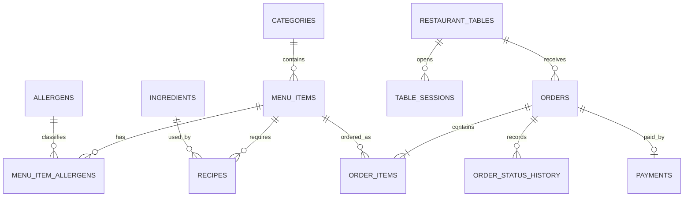

# Dine ER Relationship Map

```mermaid
erDiagram
  CATEGORIES ||--o{ MENU_ITEMS : contains
  MENU_ITEMS ||--o{ MENU_ITEM_ALLERGENS : has
  ALLERGENS ||--o{ MENU_ITEM_ALLERGENS : classifies
  MENU_ITEMS ||--o{ RECIPES : requires
  INGREDIENTS ||--o{ RECIPES : used_by
  RESTAURANT_TABLES ||--o{ TABLE_SESSIONS : opens
  RESTAURANT_TABLES ||--o{ ORDERS : receives
  ORDERS ||--|{ ORDER_ITEMS : contains
  MENU_ITEMS ||--o{ ORDER_ITEMS : ordered_as
  ORDERS ||--o{ ORDER_STATUS_HISTORY : records
  ORDERS ||--o| PAYMENTS : paid_by
```

The SQL source of truth is `schema.sql`; this diagram is a review aid.
